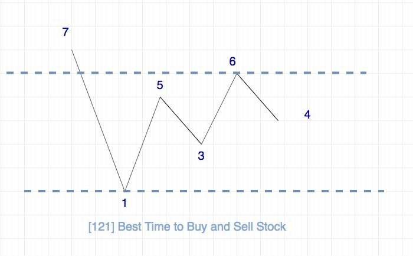

# [121. Best Time to Buy and Sell Stock](https://leetcode.com/problems/best-time-to-buy-and-sell-stock)
<span style="color:green">`Easy`</span>

You are given an array `prices` where `prices[i]` is the price of a given stock on the `ith` day.

You want to maximize your profit by choosing a **single day** to buy one stock and choosing a **different day in the future** to sell that stock.

Return _the maximum profit you can achieve from this transaction_. If you cannot achieve any profit, return `0`.

**Example 1:**

    Input: prices = [7,1,5,3,6,4]
    Output: 5
    Explanation: Buy on day 2 (price = 1) and sell on day 5 (price = 6), profit = 6-1 = 5.
    Note that buying on day 2 and selling on day 1 is not allowed because you must buy before you sell.


**Example 2:**

    Input: prices = [7,6,4,3,1]
    Output: 0
    Explanation: In this case, no transactions are done and the max profit = 0.


**Constraints:**

  * `1 <= prices.length <= 105`
  * `0 <= prices[i] <= 104`

**Related Topics:** `array` `dynamic-programming`

**Similar Questions:**

|  No  |                      Title                       | Difficulty |
| ---: | ------------------------------------------------ | ---------- |
|   53 | Maximum Subarray                                 | Easy       |
|  122 | [Best Time to Buy and Sell Stock II](./0122.md)  | Medium     |
|  123 | [Best Time to Buy and Sell Stock III](./0123.md) | Hard       |
|  188 | [Best Time to Buy and Sell Stock IV](./0188.md)  | Hard       |
|  309 | Best Time to Buy and Sell Stock with Cooldown    | Medium     |
| 2012 | Sum of Beauty in the Array                       | Medium     |
| 2016 | Maximum Difference Between Increasing Elements   | Easy       |

<br>

## Solutions [^1]:

題目的本質是計算陣列中兩個數的最大差值(右減左)，解決此問題的邏輯與使用 `Kadane's Algorithm`。

`Kadane's`

Time complextity: `O(n)` <br>
Space complexity: `O(2)`



```python
class Solution:
    """                     0   1   2   3   4   5
                           --- --- --- --- --- ---
    price:                  7   1   5   3   6   4
    buy:                X   7  `1`  1   1   1   1
    profit(price-buy):  0   0   0   4   2  `5`  3
    """
    def maxProfit(self, prices: List[int]) -> int:
        buy, profix = float('inf'), 0
        for p in prices:
            buy, profix = min(p, buy), max(profix, p - buy)
            
        return profix
```

<br>

[^1]: `2022/04/30`