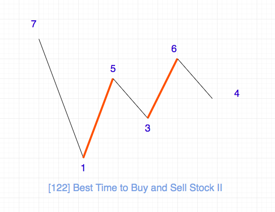

# [122. Best Time to Buy and Sell Stock II](https://leetcode.com/problems/best-time-to-buy-and-sell-stock-ii)
<span style="color:orange">`Medium`</span>

You are given an integer array `prices` where `prices[i]` is the price of a given stock on the `ith` day.

On each day, you may decide to buy and/or sell the stock. You can only hold **at most one** share of the stock at any time. However, you can buy it then immediately sell it on the **same day**.

Find and return _the **maximum** profit you can achieve_.

**Example 1:**

    Input: prices = [7,1,5,3,6,4]
    Output: 7
    Explanation: Buy on day 2 (price = 1) and sell on day 3 (price = 5), profit = 5-1 = 4.
    Then buy on day 4 (price = 3) and sell on day 5 (price = 6), profit = 6-3 = 3.
    Total profit is 4 + 3 = 7.


**Example 2:**

    Input: prices = [1,2,3,4,5]
    Output: 4
    Explanation: Buy on day 1 (price = 1) and sell on day 5 (price = 5), profit = 5-1 = 4.
    Total profit is 4.


**Example 3:**

    Input: prices = [7,6,4,3,1]
    Output: 0
    Explanation: There is no way to make a positive profit, so we never buy the stock to achieve the maximum profit of 0.


**Constraints:**

  * `1 <= prices.length <= 3 * 104`
  * `0 <= prices[i] <= 104`

**Related Topics:** `array` `dynamic-programming` `greedy`

**Similar Questions:**

| No  |                        Title                         | Difficulty |
| --: | ---------------------------------------------------- | ---------- |
| 121 | [Best Time to Buy and Sell Stock](./0121.md)         | Easy       |
| 123 | [Best Time to Buy and Sell Stock III](./0123.md)     | Hard       |
| 188 | [Best Time to Buy and Sell Stock IV](./0188.md)      | Hard       |
| 309 | Best Time to Buy and Sell Stock with Cooldown        | Medium     |
| 714 | Best Time to Buy and Sell Stock with Transaction Fee | Medium     |

<br>

## Solutions [^1]:

由於我們是想獲取到最大的利潤，我們的策略應該是低點買入，高點賣出。由於題目對於交易次數沒有限制，因此只要能夠賺錢的機會我們都不應該放過。

Time complextity: `O(n)` <br>
Space complexity: `O(1)`



```python
class Solution:
    def maxProfit(self, prices: List[int]) -> int:
        profix = 0
        for i in range(len(prices) - 1):
            if prices[i] < prices[i + 1]:
                profix += (prices[i + 1] - prices[i])

        return profix
```

<br>

[^1]: `2022/05/01`